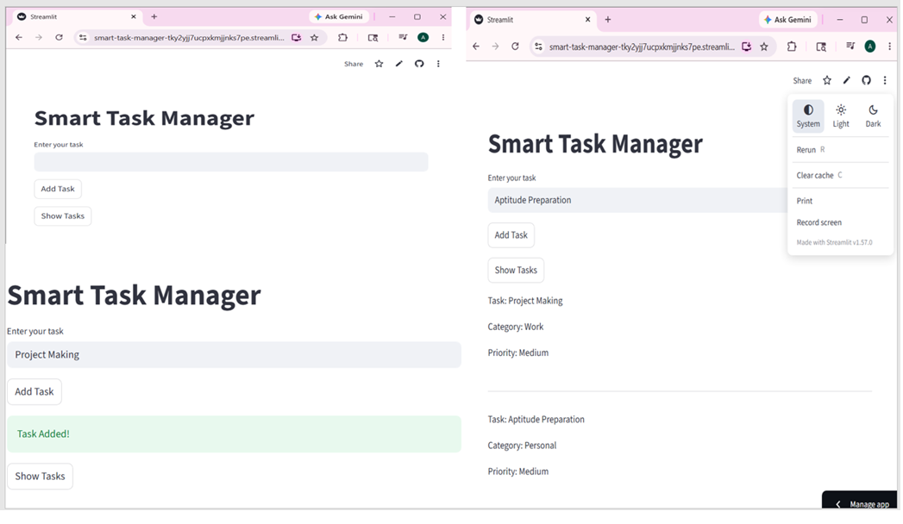

# Smart Task Manager

## Overview
This is a simple task management application built using Python and Streamlit.

## Features
- Add tasks
- Automatic categorization (Study, Work, Personal)
- Priority assignment (High, Medium, Low)
- Simple user interface

## Tech Stack
- Python
- Streamlit

Future Improvements
~AI-based task suggestions
~Deadline tracking
~Task reminders

Author
Anjali Meshram

## How to Run
```bash
streamlit run app.py


## Output



